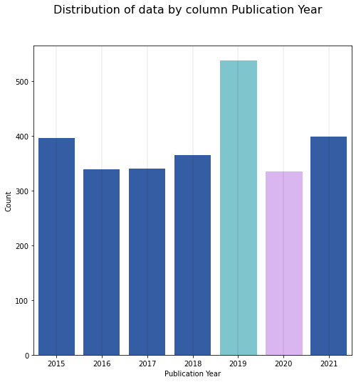

# PRACTICAL FUNCTION FOR PLOTTING THE DATA DISTRIBUTION FROM DATAFRAME/SERIES (WIHN EXAMPLE)
<p>In some cases, we need to plot the distribution of the data contained in a DataFrame. For example: In a column of type category. In this <b>Readme.md</b> explains how to use the <b>function_plot_distribution_columns</b> function an exploratory data analysis (EDA). </p>

<p align="center">

### function_plot_distribution_columns
A function designed to facilitate the analysis of the data distribution in a DataFrame column. The function returns the table with sorted single values and a graph with the data distribution.


<h3>Function_plot</h3>

<b>plot_distribution_clm</b>(<em><b>data_in</b>=None
 ,<b>clm_name</b>=None 
 ,<b>order_A_Z</b>=False
 ,<b>notplot</b>=list()
 ,<b>dif_colors</b>=False
 ,<b>point</b>=10
 ,<b>porcentage</b>=False
 ,<b>pst</b>='v'</em>):

<h4><em>Parameters</em></h4>
<em>
<b>data_in: Series or DataFrame, default None.</b> 
<br>&emsp;Dataframe that can contain Series or column of dataframe.
<br><b>clm_name: String, default None.</b> 
<br>&emsp;Name of column to plot.
<br><b>order_A_Z: Bool, default False.</b> 
<br>&emsp;Parameter to sort the output table by unique value names.
<br><b>notplot:List, default [&nbsp;].</b>
<br>&emsp;List with the name of the unique values that you dont want to plot.
<br><b>dif_colors: Bool, default False.</b>
<br>&emsp;Parameter for different the min and max values by colour.
<br><b>point: Int, default 10</b>
<br>&emsp;Parameter for indicate the number of column to visualize.
<br><b>porcentage: Bool, default False.</b>
<br>&emsp;Parameter to normalize the values of the output table and graph in percent units.
<br><b>pst: Value of Categories, Default 'v'</b>
<br>&emsp;Parameter for indicate if plot the graphic in vertical position (h) or horizontal position (h)
</em>
  
  
<!--   
```diff
-- def plot_distribution_clm(data_in  #dataframe 
+                         ,clm_name #column of dataframe
+                         ,order_A_Z  = False #parameter for sort the table by unique values names
+                         ,notplot = list() #list with the name of the unique values that you dont want to plot
+                         ,dif_colors = False #parameter for different the min and max values by colour
+                         ,point = 10 #parameter for indicate the number of column to visualize
+                         ,porcentage = False # parametert for normalise the count of unique value
+                         ,pst = 'v' #parameter for indicate if plot the graphic in vertical position (h) or horizontal position (h)
+                         ):
``` -->
